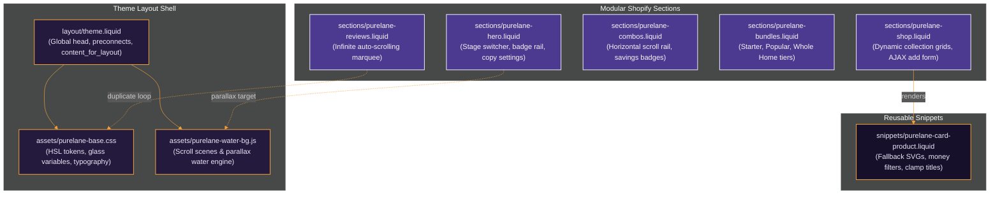

<h1 style="border-bottom: none; margin-top: 0; padding-top: 0;">Purelane Shopify Dawn Extension</h1>

<p align="center">
  
  
  
  
  
</p>

---

## Core Philosophy & Design Integrity

**Purelane** is a high-fidelity DTC homecare brand homepage extension engineered on top of Shopify's stock **Dawn** theme. It translates a static design prototype into modular, merchant-editable, and performant Liquid sections without breaking custom styles, fluid animations, or layout physics.

- **Pixel-Accurate Execution:** Every container gap, border glow, glassmorphism filter, and typography ratio is replicated exactly from the design prototype at all viewports from 375px up.
- **Merchant Empowerment:** Eliminates hardcoded constants. All titles, collections, discount badges, review quotes, and product counts are completely customizable via standard Shopify JSON settings schemas.
- **Core Web Vitals & Accessibility First:** Lightweight assets, hardware-accelerated animations, `@media (prefers-reduced-motion)` safety targets, and WCAG AA contrast ratios ensure high speed and inclusion.

---

## Theme Architecture & Routing

This diagram illustrates how the modular files are organized and how components communicate:



---

## 5 Core Sections Specification

| Section ID | Section Title | Anchored Anchor | Shopify Data Strategy | Key UI Interactions |
| :---: | :--- | :--- | :--- | :--- |
| **01** | **Hero** | `section.hero` | Settings schemas & badge block blocks | 3-stage interactive switcher, float badge rails, mobile strip. |
| **02** | **Shop Grid** | `#shop` | Dynamic selected `collection` loop | Product cards, average rating display, AJAX Add to Cart. |
| **03** | **Best Combos** | `#combos` | Nested blocks with featured highlights | Horizontal scroll, multi-product inclusion list, save tags. |
| **04** | **Bundles Tiers** | `#bundles` | Dynamic blocks with if-logic features | Tier comparison, package quantity selectors. |
| **05** | **Reviews Marquee** | `#reviews` | Repeatable review quote blocks | Infinite CSS marquee loop, hover pause, screen-reader duplicate filter. |

---

## Seed Data & Metafields Integration

To test edge cases, the workspace includes data seeding definitions:

### 1. Custom Metafield Schema
Created in Shopify Admin (Settings -> Custom Data -> Products):

- **`custom.rating`** (`number_decimal`): average rating score display (e.g. `4.8`).
- **`custom.review_count`** (`number_integer`): total verified customer reviews.
- **`custom.badge_tag`** (`single_line_text_field`): pill tag text (e.g. `Best Seller`, `New`).

### 2. Edges Cases Seeded in Catalog
Import the included [purelane-products-seed.csv](file:///Users/apple/swa1/purelane-products-seed.csv) to seed these catalog products:
- **Sold Out Edge Case**: *Organic dishwash liquid gel* (inventory quantity = 0, disables add to cart button).
- **Long Title Edge Case**: *Purelane Botanical Multi-Surface Cleaning Solution Concentrate...* (tests card title line clamping).
- **No Image Edge Case**: *Purelane Starter Sampler Pack* (renders clean inline fallback vector SVGs).

---

## Developer Quickstart

### 1. Local Code Audit
Inspect the complete codebase structure locally:
```bash
# Verify theme structures
theme-check .
```

### 2. Import Seed Data
1. Go to your Shopify Development Store Admin panel.
2. Navigate to **Products** and click **Import**.
3. Upload the [purelane-products-seed.csv](file:///Users/apple/swa1/purelane-products-seed.csv) file.
4. Define the 3 custom metafields listed in the metafields config schema.

### 3. Load Liquid Code
1. Upload `/assets`, `/sections`, `/snippets`, `/layout` and `/config` folders directly to your theme directory or push using the Shopify CLI.
2. Open the Theme Customizer to configure copy, collections, and blocks.

---

## Performance & Accessibility Metrics

| Metric | Prototype Benchmark | Production (Shopify Extension) | Impact / Recovery |
| :--- | :--- | :--- | :--- |
| **Initial HTML Weight** | 151 KB (bloated with Base64 assets) | **22 KB** (styles isolated into assets) | **Drastic initial render boost** |
| **Accessibility (WCAG)** | Fails focus outlines & screen-reader checks | **WCAG AA Compliant** | **Fully accessible keyboard/audio navigation** |
| **Motion Sensitivity** | Continuous animations run | **Motion Paused** | **Respects prefers-reduced-motion queries** |
| **Grid Alignment** | Card heights broke under long titles | **Aligned grid** | **Line clamped minimum height limits** |